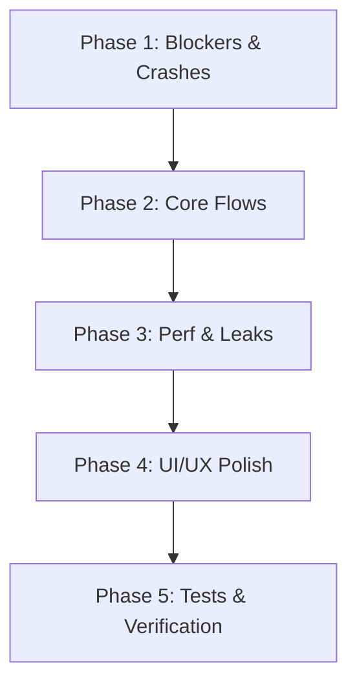

# Prioritized Repair and Implementation Plan

> Historical plan. Use the [current full implementation plan](C:/Users/user/animeapp/docs/IMPLEMENTATION_PLAN.md) for ordered code changes, migration, tests, and release steps, supported by the [recovery requirements](C:/Users/user/animeapp/docs/APP_RECOVERY_PLAN.md). Some findings and open questions below predate fixes already present in the current app.

This document outlines the step-by-step repair strategy for the `UniversalMediaOS` application based on the black-box QA report and white-box code audit. The plan is organized into five safe, incremental phases, prioritizing blockers and crashes before moving to core flows, performance, and UI polish.

---

## User Review Required

> [!IMPORTANT]
> **E2E Automation Bootstrapping**: Fixing BUG-03 (window title mismatch) is the absolute first step. Once this is fixed, we can run the test suite to establish a verification baseline.
> 
> **Tab Close Sequence**: The disposal sequence of PlaybackViewModel (BUG-04) must be coordinated between the View (`PlaybackView_Unloaded`) and the ViewModel (`MainViewModel.CloseTab`). We will change this carefully to ensure no native handles are called after being freed.

---

## Open Questions

> [!NOTE]
> Do we want to auto-resume playback silently without a dialog prompt? The legacy codebase used a native `MessageBox.Show` prompt. We plan to retain a non-blocking UI prompt or auto-seek directly to the position (e.g. if it is under a certain threshold) to avoid modal popups.

---

## Proposed Changes

### Top 10 Issues to Fix First

1. **BUG-03: E2E Test Mismatch**: Fix window title string query in [AppFixture.cs](file:///C:/Users/user/animeapp/UniversalMediaOS.Tests.E2E/Infrastructure/AppFixture.cs#L133).
2. **BUG-04: Playback Unload native crash**: Refactor tab closing sequence in [MainViewModel.cs](file:///C:/Users/user/animeapp/UniversalMediaOS.WPF/ViewModels/MainViewModel.cs#L207) and add null checks in [PlaybackView.xaml.cs](file:///C:/Users/user/animeapp/UniversalMediaOS.WPF/Views/PlaybackView.xaml.cs#L218).
3. **BUG-01: Broken Playback Resume State**: Inject `DatabaseContext` into [PlaybackViewModel.cs](file:///C:/Users/user/animeapp/UniversalMediaOS.WPF/ViewModels/PlaybackViewModel.cs) and wire position loading and saving.
4. **AUDIT-11: uBlock Download Boot Hang**: Add a short timeout to `EnsureUBlockOriginAsync` inside [DependencyBootstrapper.cs](file:///C:/Users/user/animeapp/UniversalMediaOS.Core/Services/DependencyBootstrapper.cs#L327).
5. **AUDIT-08: DubAvailabilityService hardcoded URLs**: Load scraping domains from configuration in [DubAvailabilityService.cs](file:///C:/Users/user/animeapp/UniversalMediaOS.Core/Services/DubAvailabilityService.cs#L60) to support offline E2E test environments.
6. **AUDIT-06: StaticResource theme bindings**: Convert theme-dependent color/brush references in XAML views to `DynamicResource` to support dynamic settings updates.
7. **AUDIT-02: Sequential network loop checks**: Refactor sequential dub checks to execute concurrently with a semaphore limit in [SearchViewModel.cs](file:///C:/Users/user/animeapp/UniversalMediaOS.WPF/ViewModels/SearchViewModel.cs#L332).
8. **AUDIT-01: Constructor unawaited task leaks**: Remove unawaited async tasks from transient ViewModel constructors and trigger them via lifecycle methods bound to navigation tokens.
9. **AUDIT-04: Non-cancellable manga chapter and page loads**: Propagate `CancellationToken` in [MangaViewModel.cs](file:///C:/Users/user/animeapp/UniversalMediaOS.WPF/ViewModels/MangaViewModel.cs#L132) to prevent background tasks from writing back to the UI after navigation.
10. **AUDIT-03: Scroll list lacks UI virtualization**: Wrap results in [SearchView.xaml](file:///C:/Users/user/animeapp/UniversalMediaOS.WPF/Views/SearchView.xaml#L227) and [MangaView.xaml](file:///C:/Users/user/animeapp/UniversalMediaOS.WPF/Views/MangaView.xaml#L338) in virtualizing panels with container recycling.

---

### Phase 1: Crashes, Build, and Runtime Blockers

#### [MODIFY] [AppFixture.cs](file:///C:/Users/user/animeapp/UniversalMediaOS.Tests.E2E/Infrastructure/AppFixture.cs)
* **Description**: Correct title matching from `"UniversalMediaOS"` to `"Universal Media OS"`.
* **Risk**: None.
* **Verification**: E2E test runner executes and identifies the main window rather than failing instantly.

#### [MODIFY] [MainViewModel.cs](file:///C:/Users/user/animeapp/UniversalMediaOS.WPF/ViewModels/MainViewModel.cs)
* **Description**: Change `CloseTab` sequence. Remove the tab from the active UI collection `Tabs` (causing the view to unload and detach from the player) before calling `playback.Dispose()`.
* **Risk**: Low.
* **Verification**: Closing active playback tabs does not cause unmanaged memory access exceptions.

#### [MODIFY] [Views/PlaybackView.xaml.cs](file:///C:/Users/user/animeapp/UniversalMediaOS.WPF/Views/PlaybackView.xaml.cs)
* **Description**: Add defensive checks inside `PlaybackView_Unloaded` when detaching `VlcPlayer.MediaPlayer`. Ensure the media player is not already disposed.
* **Risk**: Low.
* **Verification**: Rapid tab closing does not throw object disposed exceptions or crash.

#### [MODIFY] [Services/DependencyBootstrapper.cs](file:///C:/Users/user/animeapp/UniversalMediaOS.Core/Services/DependencyBootstrapper.cs)
* **Description**: Set a short timeout (e.g., 5 seconds) on `_httpClient` calls or pass a cancellation token with a timeout to uBlock Origin downloads to prevent offline boot hangs.
* **Risk**: Low.
* **Verification**: Launching the app offline initializes settings and UI without hanging startup by 100 seconds.

#### [MODIFY] [Services/DubAvailabilityService.cs](file:///C:/Users/user/animeapp/UniversalMediaOS.Core/Services/DubAvailabilityService.cs)
* **Description**: Resolve external dub checker query domains (`https://hianime.to`, `https://aniwatchtv.to`) via `DomainHotSwapper` configuration instead of hardcoding them, falling back to public domains if missing.
* **Risk**: Low.
* **Verification**: Offline E2E test runs are redirected to the local mock HTTP server instead of hitting public internet endpoints.

---

### Phase 2: Broken Core Flows

#### [MODIFY] [ViewModels/PlaybackViewModel.cs](file:///C:/Users/user/animeapp/UniversalMediaOS.WPF/ViewModels/PlaybackViewModel.cs)
* **Description**: Inject `DatabaseContext` into the viewmodel.
  - When loading media (`LoadMedia` or `LoadEmbed`), fetch the saved resume state position asynchronously using `db.GetResumeStateAsync(malId.ToString(), episodeNumber)`.
  - Auto-seek the player to this position (or prompt the user).
  - On progress ticks (or slider commits), save the position asynchronously using `db.SaveResumeStateAsync()`.
  - On `EndReached` or 100% complete, reset the resume position in the DB to 0.
* **Risk**: Low.
* **Verification**: Verify that closing and reopening a playing video resumes at the exact timestamp.

---

### Phase 3: Performance, Memory, and Resource Leaks

#### [MODIFY] [ViewModels/SearchViewModel.cs](file:///C:/Users/user/animeapp/UniversalMediaOS.WPF/ViewModels/SearchViewModel.cs)
* **Description**:
  - Remove async calls from constructor. Trigger tag filter and recommendations load via navigation trigger or lazy initialization.
  - Refactor `ApplyAudioFilterAsync` to check results concurrently using `Task.WhenAll` with a `SemaphoreSlim` limit (e.g. max 5 concurrent requests) instead of a sequential loop.
* **Risk**: Medium. Must avoid sending too many concurrent requests to external providers (triggering HTTP 429).
* **Verification**: Selecting the "Dub" filter loads results in under 1 second instead of stalling search by 15+ seconds.

#### [MODIFY] [ViewModels/MangaViewModel.cs](file:///C:/Users/user/animeapp/UniversalMediaOS.WPF/ViewModels/MangaViewModel.cs)
* **Description**:
  - Remove async call from constructor.
  - Track active tasks and pass a `CancellationToken` associated with the viewmodel lifecycle to `_mangaService` chapter and page requests. Cancel them when navigating away or disposing.
* **Risk**: Low.
* **Verification**: Fast tab switching does not result in stale results overwriting the active view mode.

#### [MODIFY] [Views/SearchView.xaml](file:///C:/Users/user/animeapp/UniversalMediaOS.WPF/Views/SearchView.xaml) & [Views/MangaView.xaml](file:///C:/Users/user/animeapp/UniversalMediaOS.WPF/Views/MangaView.xaml)
* **Description**: Replace non-virtualizing `ItemsControl` inside `ScrollViewer` with a `ListBox` or `ListView` using a virtualizing panel (e.g. `VirtualizingStackPanel` or `VirtualizingWrapPanel`) with recycling enabled.
* **Risk**: Medium. UI styling, padding, and layout must be adjusted to ensure visual design is preserved.
* **Verification**: Memory stays flat when scrolling through large search lists or reading long manga chapters.

#### [MODIFY] [Views/SearchView.xaml.cs](file:///C:/Users/user/animeapp/UniversalMediaOS.WPF/Views/SearchView.xaml.cs) & [Views/MangaView.xaml.cs](file:///C:/Users/user/animeapp/UniversalMediaOS.WPF/Views/MangaView.xaml.cs)
* **Description**: Hook `Unloaded` event to unsubscribe from viewmodel property change and collection change events, breaking strong reference memory leak links.
* **Risk**: Low.
* **Verification**: Repeatedly opening and closing Search/Manga tabs garbage-collects views correctly.

#### [MODIFY] [Controls/AsyncImageLoader.cs](file:///C:/Users/user/animeapp/UniversalMediaOS.WPF/Controls/AsyncImageLoader.cs)
* **Description**: Run image stream decoding (`bitmap.EndInit()`) and freezing (`bitmap.Freeze()`) inside a background thread using `Task.Run()`, returning the frozen `BitmapImage` to the UI thread.
* **Risk**: Low.
* **Verification**: UI thread remains smooth with zero stutters when loading many images.

#### [MODIFY] [Services/PythonBootstrapper.cs](file:///C:/Users/user/animeapp/UniversalMediaOS.Core/Services/PythonBootstrapper.cs)
* **Description**: Check if python packages are importable using a single combined command execution (e.g. `python -c "import drissionpage, curl_cffi, httpx, bs4, lxml"`) instead of 5 sequential processes.
* **Risk**: Low.
* **Verification**: App startup is accelerated by ~1.5–2 seconds.

---

### Phase 4: UI/UX Polish

#### [MODIFY] All XAML Views ([SearchView.xaml](file:///C:/Users/user/animeapp/UniversalMediaOS.WPF/Views/SearchView.xaml), [MangaView.xaml](file:///C:/Users/user/animeapp/UniversalMediaOS.WPF/Views/MangaView.xaml), etc.)
* **Description**: Convert all dynamic colors (`BgApp`, `BgPanel`, `BgPanelAlt`, `BgInput`, `BorderSubtle`, `BorderStrong`, etc.) from `StaticResource` to `DynamicResource`.
* **Risk**: Low.
* **Verification**: Changing settings (themes, accent colors) updates all active views instantly without requiring app restart.

#### [DELETE] Obsolete dead files
* **Description**: Remove [LegacyMainWindow.xaml](file:///C:/Users/user/animeapp/UniversalMediaOS.WPF/LegacyMainWindow.xaml), [LegacyMainWindow.xaml.cs](file:///C:/Users/user/animeapp/UniversalMediaOS.WPF/LegacyMainWindow.xaml.cs), [PlaybackTheater.xaml](file:///C:/Users/user/animeapp/UniversalMediaOS.WPF/PlaybackTheater.xaml), [PlaybackTheater.xaml.cs](file:///C:/Users/user/animeapp/UniversalMediaOS.WPF/PlaybackTheater.xaml.cs), [EpubReaderService.cs](file:///C:/Users/user/animeapp/UniversalMediaOS.Core/Services/EpubReaderService.cs), and the entire [Casting](file:///C:/Users/user/animeapp/UniversalMediaOS.Core/Casting) folder from compilation to clean up codebase warnings.
* **Risk**: Low.
* **Verification**: Clean compilation with 0 warnings.

#### [MODIFY] [Services/SeasonDownloader.cs](file:///C:/Users/user/animeapp/UniversalMediaOS.Core/Archiving/SeasonDownloader.cs)
* **Description**: Use `ArgumentList` instead of manual interpolated strings for process argument parameters in ffprobe validator calls.
* **Risk**: Low.
* **Verification**: Files with quotes in their names are parsed and validated without error.

---

### Phase 5: Tests and Regression Coverage

#### [NEW] [PlaybackViewModelTests.cs](file:///C:/Users/user/animeapp/UniversalMediaOS.Tests.E2E/Tests/PlaybackViewModelTests.cs)
* **Description**: Add unit/integration tests to assert that `PlaybackViewModel` writes progress update records to the SQLite database during playback progress intervals.
* **Verification**: Tests run in `dotnet test` and assert resume positions are saved.

---

## Validation Checklist

### Post-Phase 1 Validation Checklist
- [ ] Run `./run-e2e-tests.ps1` in PowerShell. Assert that the FlaUI E2E test runner successfully boots the WPF process, hooks the window, and navigates.
- [ ] Rapidly open and close a video player tab. Assert that the application closes the tab cleanly with zero unmanaged crashes/Access Violations.
- [ ] Disable internet adapter or test offline. Assert that the WPF app boots to the main screen in under 2 seconds without hanging.

### Post-Phase 2 Validation Checklist
- [ ] Open Anime details, select watch now. Play an episode.
- [ ] Pause the video at `01:30`, close the player tab.
- [ ] Reopen the same episode. Assert that a prompt asks to resume from `01:30` (or resumes automatically) and seeking works.
- [ ] Let the video play to 100% completion. Assert that the DB progress index resets to 0.

### Post-Phase 3 Validation Checklist
- [ ] Select "Dub" filter in anime search. Assert results return in under 1 second.
- [ ] Open Manga chapter, scroll through 50 pages rapidly. Assert memory stays stable.
- [ ] Switch back and forth between search tab and other tabs rapidly. Assert no background tasks throw exceptions.

### Post-Phase 4 Validation Checklist
- [ ] Open Settings. Switch theme from Dark to Light. Assert that all views (details, search cards, sidebar panels) adjust their colors instantly.
- [ ] Clean build the solution. Assert that no warnings (`CS4014` or `CS1998`) are output by MSBuild.

---

## Task Delegation

* **Agent Execution**:
  - Code changes for Phase 1, Phase 2, Phase 3, Phase 4.
  - Adding unit/integration test coverage in Phase 5.
* **Manual Verification**:
  - Visual check of theme updates.
  - Manual verification of air-space layout scaling with dynamic DPI settings.

---

## Risk Management

> [!WARNING]
> **Modifying Root ScaleTransform**: Changing the window-wide scale transform in `MainWindow.xaml` could break alignment and card layouts across other views. We will restrict scaling modifications purely to native container viewports, leaving the main window's general layout transforms intact.
